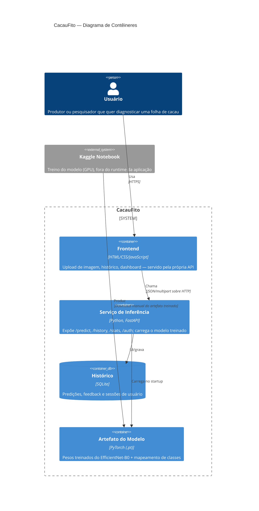
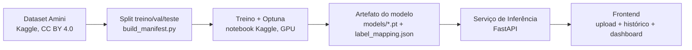
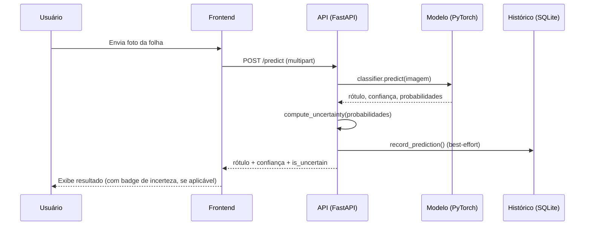

# Diagrama de Arquitetura — CacauFito

## Diagrama de contêineres (nível C4 — Container)

## Pipeline de dados e treino

## Fluxo de uma predição (sequência)

## Notas de arquitetura

- **Contratos claros entre módulos**: `model.py` (inferência pura) não conhece `history.py` (storage); `main.py` (camada HTTP) integra os dois, mas cada um pode ser testado isoladamente (ver `tests/test_uncertainty.py`, `tests/test_history.py`).
- **Baixo acoplamento com o treino**: o treino roda inteiramente fora do runtime da aplicação (notebook Kaggle); o serviço de inferência só depende do artefato final (`models/*.pt`), nunca do pipeline de treino em si.
- **Registro best-effort**: uma falha ao gravar histórico nunca derruba `/predict` (ver `tests/test_predict_history_integration.py`) — decisão registrada em `openspec/changes/archive/2026-09-04-add-prediction-history/design.md`.
